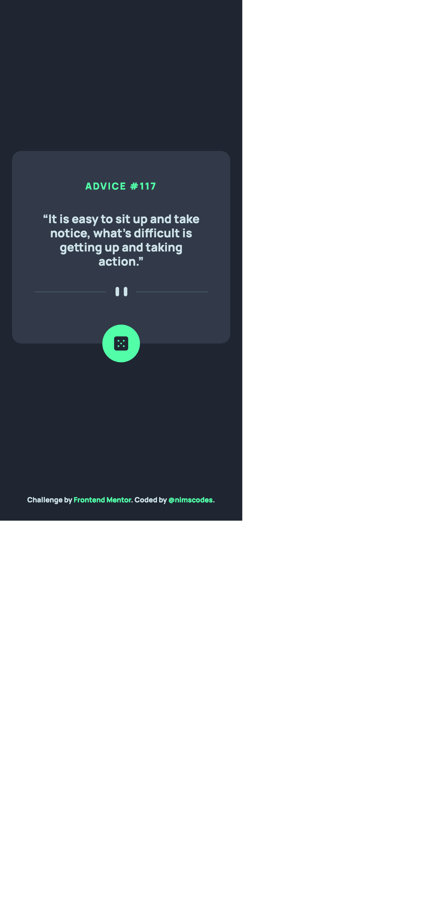
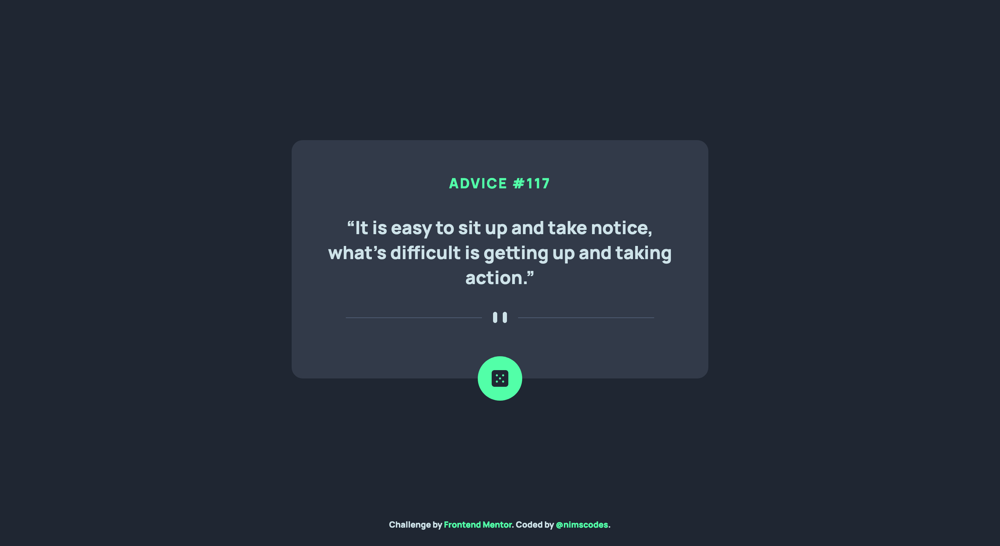

# Frontend Mentor - Advice generator app solution

This is a solution to the [Advice generator app challenge on Frontend Mentor](https://www.frontendmentor.io/challenges/advice-generator-app-QdUG-13db). Frontend Mentor challenges help you improve your coding skills by building realistic projects.

## Table of contents

- [Overview](#overview)
  - [The challenge](#the-challenge)
  - [Screenshot](#screenshot)
  - [Links](#links)
- [My process](#my-process)
  - [Built with](#built-with)
  - [Useful resources](#useful-resources)
- [Author](#author)

## Overview

### The challenge

Users should be able to:

- View the optimal layout for the app depending on their device's screen size
- See hover states for all interactive elements on the page
- Generate a new piece of advice by clicking the dice icon

### Screenshot

- Mobile View

- Desktop View

### Links

- Solution URL: [https://github.com/nimscodes/advice-generator-app](https://github.com/nimscodes/advice-generator-app)
- Live Site URL: [https://nimscodes.github.io/advice-generator-app/](https://nimscodes.github.io/advice-generator-app/)

## My process

### Built with

- Semantic HTML5 markup
- CSS custom properties
- Flexbox
- Mobile-first workflow
- Vanilla JavaScript

### Useful resources

- [Creating Glow Effects with CSS](https://codersblock.com/blog/creating-glow-effects-with-css/) - This helped me create the glowing effect of the dice button. I really liked this pattern and will use it going forward.
- [Using the Fetch API](https://developer.mozilla.org/en-US/docs/Web/API/Fetch_API/Using_Fetch) - This is documentation which helped me finally understand fetching APIs. I'd recommend it to anyone still learning this concept.

## Author

- Website - [Prince Andrews Nimako](https://nimscodes.vercel.app/)
- Frontend Mentor - [@nimscodes](https://www.frontendmentor.io/profile/nimscodes)
